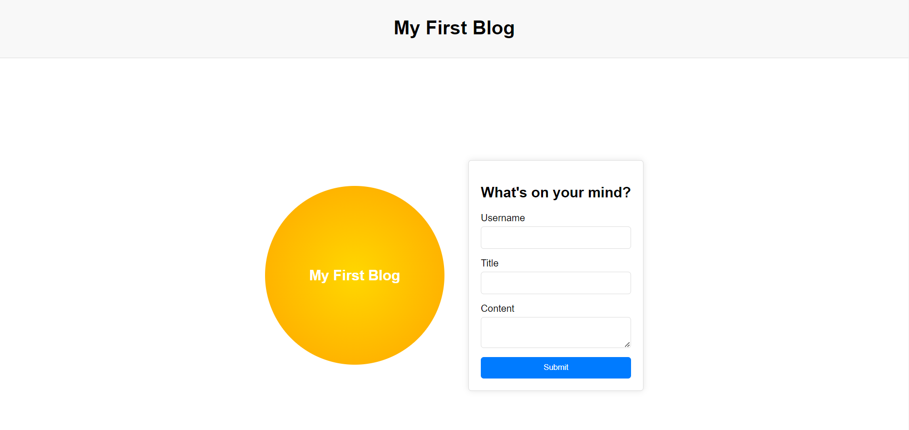
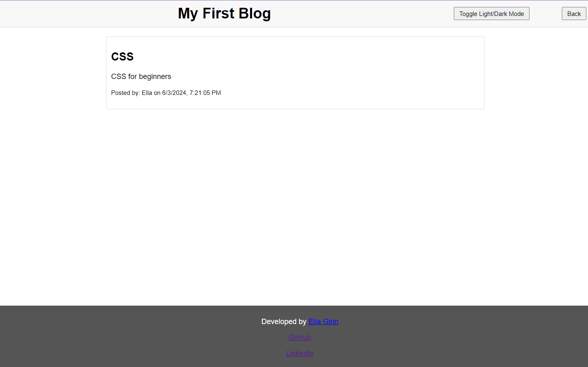
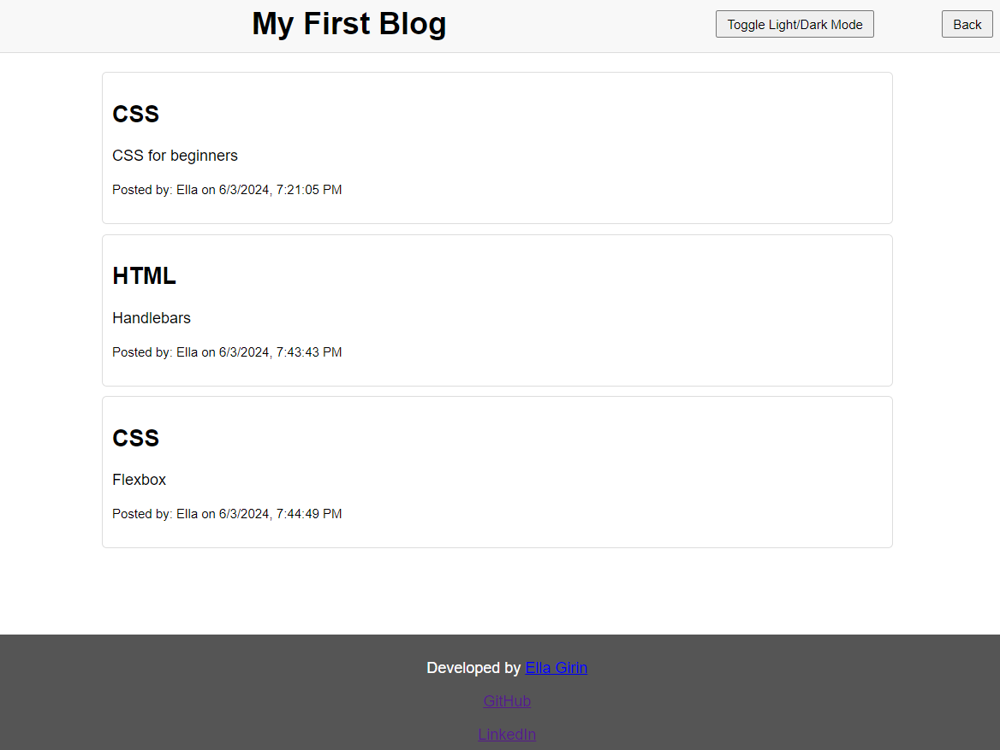
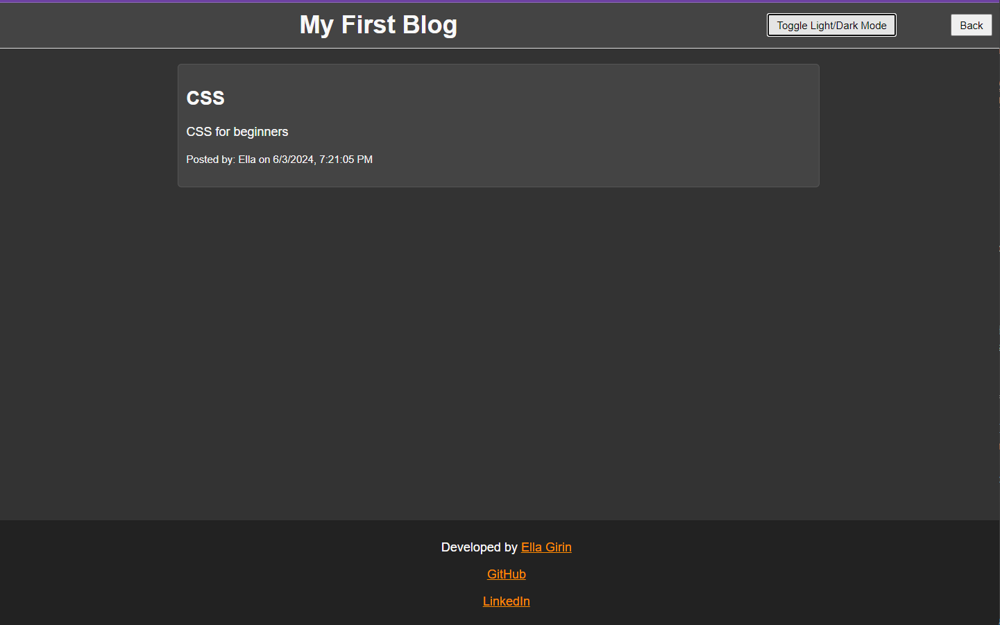

# personal-blog
This repository contains the Web APIs Challenge: Personal Blog, a two-page web application where you can input and view your blog posts. It features a form for creating posts, dynamic blog rendering, and a light/dark mode toggle, offering practical JavaScript experience and DOM manipulation with localStorage

Live at: https://ellafsd.github.io/personal-blog/

## Screenshots

### Landing Page

### Blog Posts Page

### Dark Mode

